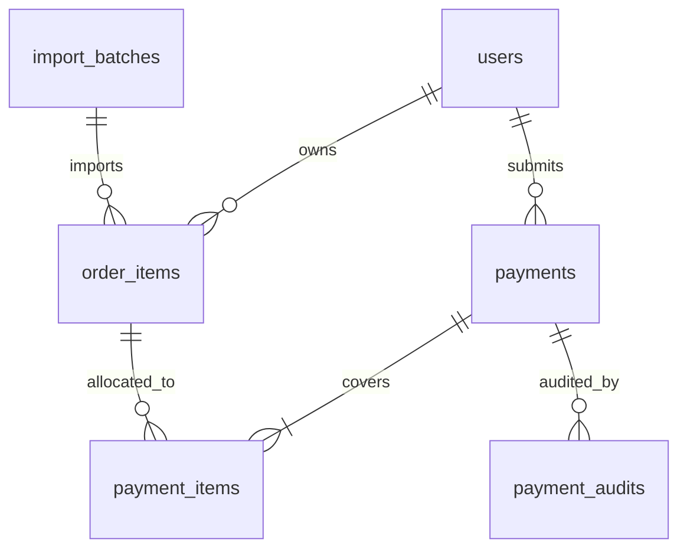

# 数据库定稿（迁移前）

## 结论

- 普通用户先使用 `CN + 查询码` 模式，不做完整账号密码登录。
- 新库不再直接沿用旧版 `payment_records` 扁平表，改为 `payments + payment_items + payment_audits`。
- 导入得到的订单明细与付款记录彻底分离，审核通过后再做核销。

## 为什么先不用完整登录

- 旧版用户流程已经围绕 `CN` 查询建立，迁移成本最低。
- 完整登录会立刻引入注册、找回密码、会话、风控和客服流程，当前阶段收益不高。
- 查询码可以先满足“查看自己的订单、上传付款截图、查看审核状态”。

## 用户访问方案

- `users.cn_code`：展示给管理员和导入逻辑用的业务主键。
- `users.query_code_hash`：存储查询码哈希值，不保存明文。
- 用户进入新前端时输入 `CN + 查询码`，后端签发短期会话。

## 推荐表关系

## 核心表

### `users`

- `id uuid primary key`
- `cn_code text unique not null`
- `display_name text`
- `query_code_hash text not null`
- `status text not null default 'active'`
- `created_at timestamptz not null`
- `updated_at timestamptz not null`

### `import_batches`

- `id uuid primary key`
- `source_file_name text not null`
- `source_sha256 text not null`
- `parser_version text not null`
- `imported_at timestamptz not null`
- `notes text`

### `order_items`

- `id uuid primary key`
- `import_batch_id uuid not null references import_batches(id)`
- `user_id uuid references users(id)`
- `legacy_record_id text unique`
- `source_sheet text not null`
- `source_row_key text not null`
- `item_name text not null`
- `role_name text not null`
- `batch_name text not null`
- `quantity numeric(12,2) not null`
- `unit_price numeric(12,2) not null`
- `amount numeric(12,2) not null`
- `payment_status text not null default 'unpaid'`
- `created_at timestamptz not null`

### `payments`

- `id uuid primary key`
- `user_id uuid not null references users(id)`
- `legacy_payment_id text unique`
- `submitted_amount numeric(12,2) not null`
- `payment_method text not null`
- `screenshot_storage_path text not null`
- `note text`
- `status text not null default 'submitted'`
- `submitted_at timestamptz not null`
- `approved_at timestamptz`
- `approved_by text`
- `rejected_at timestamptz`
- `rejected_by text`
- `rejection_reason text`
- `created_at timestamptz not null`
- `updated_at timestamptz not null`

### `payment_items`

- `id uuid primary key`
- `payment_id uuid not null references payments(id) on delete cascade`
- `order_item_id uuid not null references order_items(id)`
- `applied_amount numeric(12,2) not null`
- `created_at timestamptz not null`
- `unique (payment_id, order_item_id)`

### `payment_audits`

- `id uuid primary key`
- `payment_id uuid not null references payments(id) on delete cascade`
- `action text not null`
- `from_status text`
- `to_status text not null`
- `actor_type text not null`
- `actor_ref text`
- `note text`
- `created_at timestamptz not null`

## 旧表映射

- 旧版 `records` -> 新版 `order_items`
- 旧版 `payment_records` -> 新版 `payments`
- 旧版 `item_list` 文本 -> 新版 `payment_items`
- 旧版 `approved` / `approved_at` -> 新版 `payments.status` / `approved_at`

## 需要坚持的约束

- 一个付款截图只能属于一条 `payments` 记录。
- 一个付款可以覆盖多个 `order_items`。
- `order_items` 允许被拆分支付，所以核销金额放在 `payment_items.applied_amount`。
- 付款一旦审核通过，原始截图不可覆盖，只能追加新的支付记录或走撤销审核。
