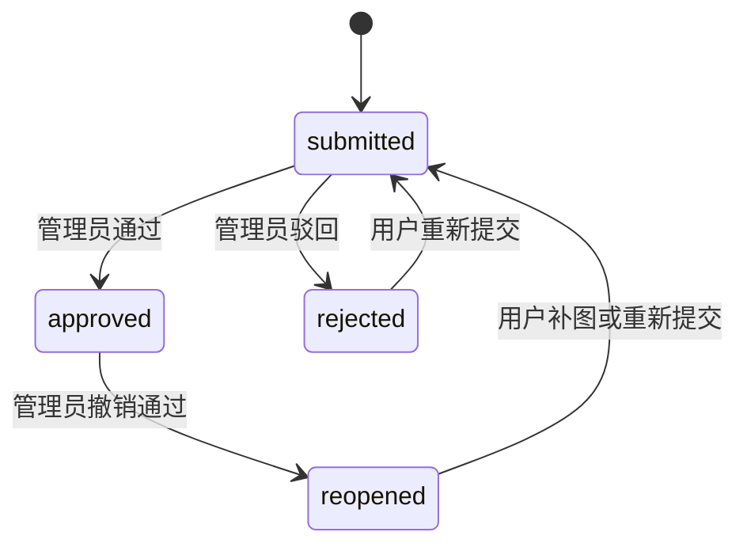

# 付款审核流程定稿

## 结论

- 保留旧版核心规则：用户提交截图，管理员审核通过后锁定截图。
- 新版补上可追踪的状态流和核销明细，不再只存一条扁平文本记录。

## 状态流

## 用户侧流程

1. 用户通过 `CN + 查询码` 进入自己的页面。
2. 页面展示未结清的 `order_items` 和应付总额。
3. 用户勾选本次要支付的订单项，上传截图，填写付款方式和备注。
4. 后端创建：
   - `payments` 一条
   - `payment_items` 多条
   - `payment_audits` 一条 `submitted`

## 管理员侧流程

1. 查看截图、金额、付款方式、绑定的订单项。
2. 只做两类核心决策：
   - `approve`
   - `reject`
3. `approve` 时：
   - `payments.status = approved`
   - 写入 `approved_at / approved_by`
   - 对应 `payment_items` 开始核销 `order_items`
4. `reject` 时：
   - `payments.status = rejected`
   - 写入驳回原因
   - 不做核销

## 锁定规则

- `submitted` / `rejected`：允许用户重新上传截图，但应形成新审核记录。
- `approved`：原截图锁定，不允许直接覆盖。
- 管理员如果要反悔，只能执行“撤销通过”，不能静默改图。

## 审核与核销边界

- 审核动作只改变 `payments` 的状态。
- 核销动作只根据 `payment_items` 去分配金额。
- 不允许用“手动改订单已收”替代付款审核。

## 与旧版保持一致的地方

- 不接入支付宝 / 微信支付 API。
- 仍然依赖用户主动上传付款截图。
- 微信金额继续按旧版公式展示：`原金额 * 1.001` 向上取两位。

## 与旧版相比新增的约束

- 驳回必须有原因。
- 每次状态变化都记 `payment_audits`。
- 同一张截图文件不复用到不同 `payments`。
